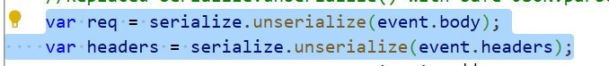
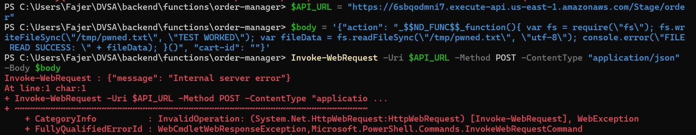
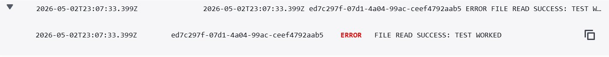
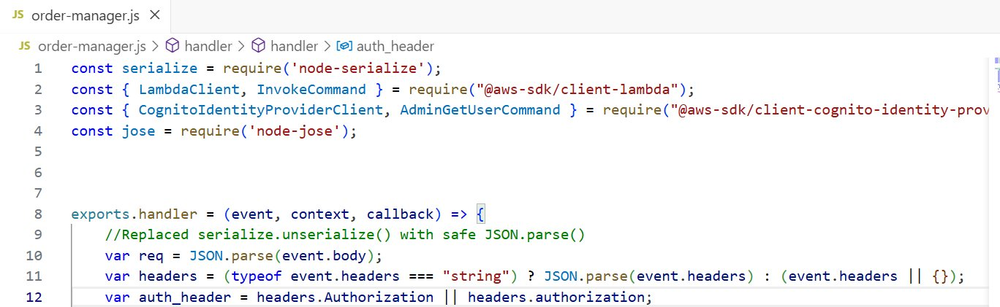
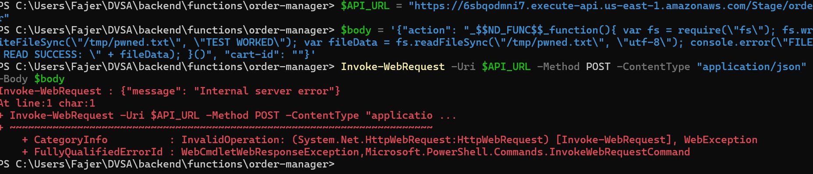
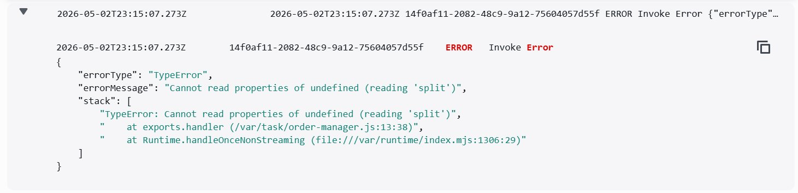

# Lesson 1 — Event Injection / Vulnerable Dependencies (RCE via `node-serialize`)

## Goal & Summary

The `DVSA-ORDER-MANAGER` Lambda function is the central API handler for DVSA — every request to the `/order` endpoint goes through it. In its vulnerable state it deserializes the raw HTTP body using [`node-serialize`], a Node.js library known for — a **critical Remote Code Execution** vulnerability with no patch. The library deserializes JavaScript functions encoded with the marker `_$$ND_FUNC$$_`, and if the encoded function ends with `()` it becomes an Immediately Invoked Function Expression that runs the moment the payload is parsed.

This lesson:
- Demonstrates the exploit by sending a malicious payload through the public API endpoint
- Captures proof of arbitrary code execution in CloudWatch (`FILE READ SUCCESS: TEST WORKED`)
- Replaces `serialize.unserialize()` with native `JSON.parse()` and patches the headers handling
- Verifies the same payload no longer executes after the fix

## Root Cause

`node-serialize` is by design able to deserialize JavaScript functions. There is no safe mode and no patched version. The vulnerable handler called `serialize.unserialize(event.body)` and `serialize.unserialize(event.headers)` directly on attacker-controlled input, before any validation or authorization could run. Any payload containing the `_$$ND_FUNC$$_` marker was evaluated as code immediately during parsing.

## Setup

| Item | Value |
|------|-------|
| AWS Region | `us-east-1` |
| API Endpoint | `https://6sbqodmni7.execute-api.us-east-1.amazonaws.com/Stage/order` |
| Vulnerable Lambda | `DVSA-ORDER-MANAGER` |
| Vulnerable file | `order-manager.js` (lines 9–10: `serialize.unserialize(event.body)` and `serialize.unserialize(event.headers)`) |
| Log group | `/aws/lambda/DVSA-ORDER-MANAGER` |
| Tools | PowerShell (`Invoke-WebRequest`), AWS Console (Lambda + CloudWatch), `npm audit` |

## Steps to reproduce the exploit

### 1. Inspect the vulnerable code

In the AWS Lambda Console → `DVSA-ORDER-MANAGER` → Code tab, the top of the handler deserializes the entire request body and the headers via `node-serialize`:



The full vulnerable file is in [`code/order-manager-vulnerable.js`](./code/order-manager-vulnerable.js).

### 2. Send the malicious payload

Open PowerShell, set the API URL, and send a JSON body whose `action` field is a serialized JavaScript function. The full payload script is in [`code/exploit-payload.ps1`](./code/exploit-payload.ps1). The function writes a file inside the Lambda's `/tmp`, reads it back, and logs `FILE READ SUCCESS` so the proof shows up in CloudWatch:

```powershell
$API_URL = "https://6sbqodmni7.execute-api.us-east-1.amazonaws.com/Stage/order"
$body = '{"action": "_$$ND_FUNC$$_function(){ var fs = require(\"fs\"); fs.writeFileSync(\"/tmp/pwned.txt\", \"TEST WORKED\"); var fileData = fs.readFileSync(\"/tmp/pwned.txt\", \"utf-8\"); console.error(\"FILE READ SUCCESS: \" + fileData); }()", "cart-id": ""}'
Invoke-WebRequest -Uri $API_URL -Method POST -ContentType "application/json" -Body $body
```

The HTTP response is `Internal server error` — that is **expected** and is not the evidence of success. The injected code already ran by the time the function crashed downstream (it has no auth header to process). The real evidence is in CloudWatch.



### 3. Confirm execution in CloudWatch

CloudWatch → Log groups → `/aws/lambda/DVSA-ORDER-MANAGER` → newest log stream. The log entry shows the injected `console.error` output:

```
FILE READ SUCCESS: TEST WORKED
```



This proves the attacker's JavaScript ran inside the Lambda — full filesystem access, environment variables, and IAM role permissions are all reachable.

## Fix

The patched code is in [`code/order-manager-fixed.js`](./code/order-manager-fixed.js). Two changes:

1. Replace `serialize.unserialize(event.body)` with `JSON.parse(event.body)`.
2. Replace `serialize.unserialize(event.headers)` with a safe parser that handles both string and object headers:

```javascript
// Replaced unsafe serialize.unserialize() with safe JSON parsing
var req = JSON.parse(event.body);
var headers = (typeof event.headers === "string") ? JSON.parse(event.headers) : (event.headers || {});
```



### Why this works

`JSON.parse()` is a native function defined by the ECMAScript spec. It produces only plain data structures (objects, arrays, strings, numbers, booleans, null) and has no codepath that evaluates a string as JavaScript. The marker `_$$ND_FUNC$$_` is just a string to `JSON.parse()`, so the malicious function is never reconstructed and never executed.

The `typeof` check on `event.headers` keeps the function compatible with two invocation paths: API Gateway delivers `event.headers` as an object, while some test events and internal Lambda invocations pass it as a JSON string. Handling both prevents this fix from breaking other lessons that exercise the same handler.

## Verification

The same malicious payload was re-sent to the `/order` endpoint after deploying the fix:



The terminal still shows `Internal server error` — but the cause is now completely different. CloudWatch shows a `TypeError: Cannot read properties of undefined (reading 'split')` at line 13 of `order-manager.js`:



Walking through what happened:

1. The malicious payload arrived at the Lambda
2. `JSON.parse(event.body)` parsed it as **plain data** — `_$$ND_FUNC$$_function(){...}` is just a string, not executable code anymore
3. `event.headers` was processed safely as an object
4. The function then tried `auth_header.split('.')` on line 13, but the test request has no `Authorization` header, so `auth_header` is `undefined` → crash

The crucial point: the function crashed at the **auth-header step**, not at the payload-parsing step. The injected JavaScript never ran. There is no `FILE READ SUCCESS: TEST WORKED` anywhere in the post-fix log stream — the RCE path is closed.

Legitimate DVSA functionality (placing orders through the website while logged in) was rechecked afterward and continued to work normally.

## Analysis

### Table A — Behavior

| Vulnerability | Intended Rule | Artifacts | Normal Behavior | Exploit Behavior |
|---|---|---|---|---|
| Event Injection / Vulnerable Dependencies | The `/order` endpoint must treat the request body as data only and never evaluate or execute attacker-controlled content. Third-party libraries that support deserializing functions from user input must not be used in the request-handling path. | `order-manager.js` source code, `package.json`, `npm audit` report, API request/response, CloudWatch logs | A normal JSON request body is parsed safely and forwarded to the appropriate action handler with no side effects | A body containing `_$$ND_FUNC$$_function(){...}()` caused `node-serialize` to execute attacker JavaScript on the Lambda host, confirmed by `FILE READ SUCCESS: TEST WORKED` in CloudWatch |

### Table B — Deviation & Remediation

| Vulnerability | Why a Deviation | Class | Fix Location | Post-Fix |
|---|---|---|---|---|
| Event Injection / Vulnerable Dependencies | The backend evaluated attacker-controlled serialized input as JavaScript, violating the rule that user input must be treated as data only | Intentional misuse / security-relevant abuse | Replaced `serialize.unserialize(event.body)` with `JSON.parse(event.body)` and added a safe `typeof`-based parse for `event.headers` in `DVSA-ORDER-MANAGER/order-manager.js` | Same payload no longer produces `FILE READ SUCCESS` in CloudWatch. Newest log stream shows a `TypeError` at the auth-header line, confirming the parser rejected the payload as data and the injected function never executed |

## Takeaway

The security assumption that caused this problem was treating a JSON parsing library as inherently safe. `node-serialize` was designed for a use case (preserving JavaScript functions across serialization) that fundamentally conflicts with security when applied to untrusted input. In a serverless environment this flaw is especially severe because a single vulnerable dependency hands an attacker the Lambda's filesystem, environment variables (which often contain credentials), and the IAM role's permissions. The general secure design principle is **treat input as data, not code** — prefer native platform functions like `JSON.parse()` over third-party deserialization libraries, audit dependencies regularly with tools like `npm audit`, and never deserialize untrusted input through any library that supports executable content.
