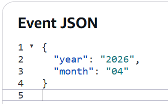
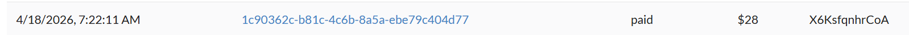
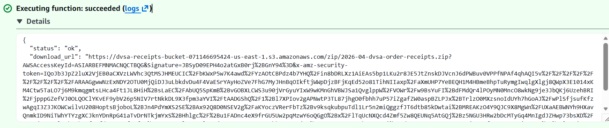
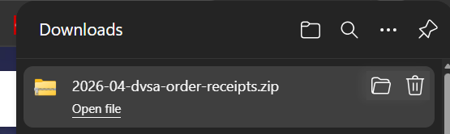
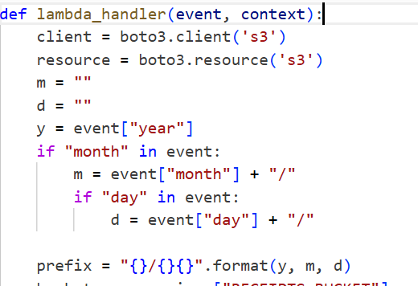
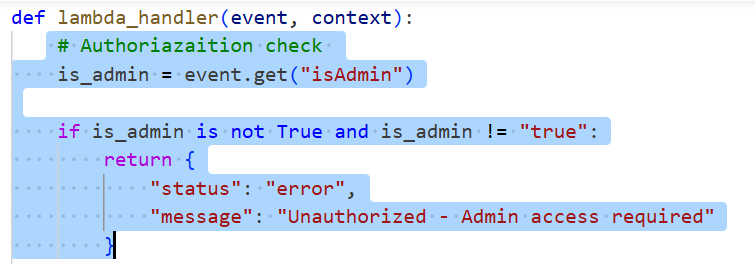
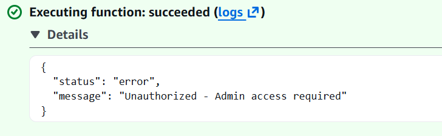

# Lesson 3 — Sensitive Information Disclosure

## Goal & Summary

The `DVSA-ADMIN-GET-RECEIPT` Lambda function generates a ZIP archive of order receipts stored in S3 and returns a pre-signed download URL to the caller. It's supposed to be admin-only — receipts contain customer order data and should not be exposed to regular users. In its vulnerable state the function performs **no authorization check at all**: any caller who can invoke the function (or send the right event JSON via the AWS Console's Test tab) gets a signed URL and can download the entire archive.

This lesson:
- Demonstrates the exploit by sending a minimal `{ "year": "2026", "month": "04" }` event to the Lambda
- Confirms the signed URL works and a real ZIP file downloads in the browser
- Adds an admin check at the very top of the handler so unauthorized requests are rejected
- Verifies the same event now returns `Unauthorized – Admin access required`

## Root Cause

The handler accepts the user's `year` / `month` input, builds an S3 prefix from it, lists matching receipt objects, packages them into a ZIP, and returns a pre-signed S3 URL. There is **no check** for caller identity or role anywhere before the S3 access happens. The function silently treats every invocation as authorized.

## Setup

| Item | Value |
|------|-------|
| AWS Region | `us-east-1` |
| Backend | AWS Lambda + API Gateway |
| Storage | Amazon S3 (DVSA receipts bucket) |
| Target Lambda | `DVSA-ADMIN-GET-RECEIPT` |
| S3 Bucket | `dvsa-receipts-bucket` |
| Tools | AWS Console → Lambda Test tab, CloudWatch Logs, Browser (to fetch the signed URL) |

## Steps to reproduce the exploit

1. **Open the target Lambda.** AWS Console → Lambda → `DVSA-ADMIN-GET-RECEIPT` → **Test** tab.

2. **Build a test event.** Replace the sample event with a minimal request that asks for a specific month's receipts. The full test event is in [`code/exploit-test-event.json`](./code/exploit-test-event.json):

   ```json
   {
     "year": "2026",
     "month": "04"
   }
   ```

   

3. **(Optional) Pick a target order to verify against.** Any order in the chosen month will end up in the resulting ZIP. The order ID below is one of the receipts that landed in the downloaded archive:

   

4. **Invoke the function.** Click **Test**. The vulnerable build returns `status: ok` plus a long pre-signed S3 URL containing `AWSAccessKeyId`, `Signature`, and `x-amz-security-token`:

   

5. **Confirm the data leaked.** Paste the `download_url` into a browser. The ZIP file `2026-04-dvsa-order-receipts.zip` downloads successfully — proving an unauthorized caller just walked away with all April 2026 receipts:

   

## Fix

The vulnerable handler jumps straight into S3 work with no gate-check:



The patched handler adds an admin check **as the very first thing it does**, before any S3 client is even constructed. The full patched function is in [`code/lambda_function_fixed.py`](./code/lambda_function_fixed.py); the relevant block is:

```python
def lambda_handler(event, context):
    # Authorization check
    is_admin = event.get("isAdmin")

    if is_admin is not True and is_admin != "true":
        return {
            "status": "error",
            "message": "Unauthorized - Admin access required"
        }

    # ... existing receipt-building logic continues unchanged ...
```



### Why this works

The check runs **before** the function builds an S3 client, lists objects, generates the ZIP, or creates a pre-signed URL. A non-admin request returns immediately with a generic error and never touches S3. The check accepts both `True` (boolean) and `"true"` (string) so the function works whether the caller is API Gateway (which serializes everything to strings) or another Lambda (which can pass real booleans).

> ⚠️ This is a starting fix. The most robust version reads the caller's identity from the verified JWT (`token["scope"]` or a Cognito group claim) instead of trusting an `isAdmin` field in the event body, since clients shouldn't be able to set their own admin flag. For this lesson the `isAdmin` check is enough to demonstrate the principle and stop the exploit.

## Verification

Re-run the same `{ "year": "2026", "month": "04" }` test event after deploying the patch. The Lambda now returns:

```json
{
  "status": "error",
  "message": "Unauthorized - Admin access required"
}
```



No `download_url` is generated. No S3 listing happens. No ZIP is built.

## Analysis

### Table A — Behavior

| Vulnerability | Intended Rule | Artifacts Used | Normal Behavior | Exploit Behavior |
|---|---|---|---|---|
| Sensitive Information Disclosure | Only admin users may invoke `DVSA-ADMIN-GET-RECEIPT` to fetch receipt archives | Lambda function code, test event JSON, Lambda response, downloaded ZIP file | Admin requests return a signed URL pointing to a ZIP of the requested month's receipts | A non-admin request with no identity claims returned the same signed URL; the ZIP downloaded successfully in a regular browser |

### Table B — Deviation & Remediation

| Vulnerability | Why a Deviation | Class | Fix Location | Post-Fix |
|---|---|---|---|---|
| Sensitive Information Disclosure | The function accessed S3 and produced signed URLs without verifying caller identity, exposing customer receipts | Security misuse / access-control failure | `DVSA-ADMIN-GET-RECEIPT/lambda_function.py` — added `isAdmin` check at the top of `lambda_handler` | Same test event returns `Unauthorized – Admin access required`; no signed URL is generated and no S3 access occurs |

## Takeaway

S3 itself was configured fine — the bucket was private, objects weren't public, encryption was on. The data leaked anyway because the **application logic** in front of S3 didn't check who was asking. In a serverless architecture every Lambda that touches sensitive data is its own access-control point: there's no central app server doing it for you. The rule is "validate identity *before* accessing the resource, not after." Pre-signed URLs are especially dangerous because once one is generated it grants S3 access to anyone who has the link, regardless of how they got it.
