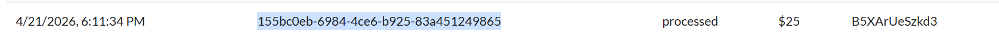
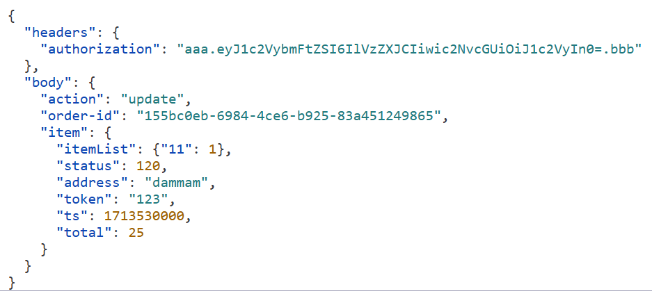
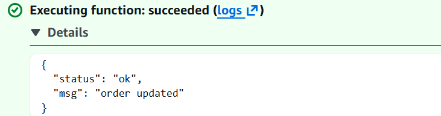
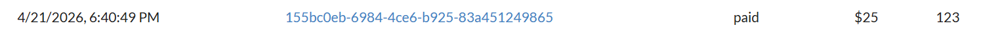
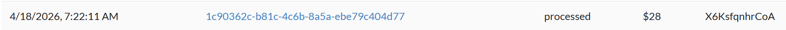
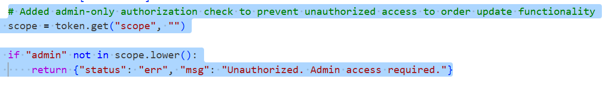
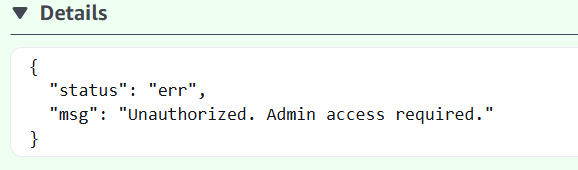
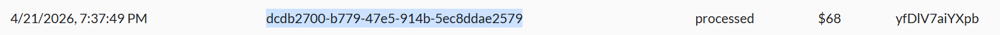

# Lesson 5 — Broken Access Control

## Goal & Summary

The `DVSA-ADMIN-UPDATE-ORDERS` Lambda function is supposed to be admin-only — it lets an administrator change an order's status (e.g. mark it `paid` after manual review). In its vulnerable state the function decodes the JWT but never checks the `scope` claim, so **any authenticated user** can invoke it and flip an order from `processed` to `paid` without ever paying.

This lesson:
- Demonstrates the exploit using the AWS Console's Lambda **Test** tab with a non-admin token
- Confirms the order status visibly changes in the DVSA UI
- Adds a server-side scope check inside the Lambda handler to enforce admin-only access
- Verifies that a non-admin token now gets rejected

## Root Cause

The handler validated that a JWT was present and well-formed, but never inspected the `scope` claim. Authentication ≠ authorization. Any user with a valid login token could invoke an admin-only operation.

## Setup

| Item | Value |
|------|-------|
| AWS Region | `us-east-1` |
| Target Lambda | `DVSA-ADMIN-UPDATE-ORDERS` |
| Test Order ID | `155bc0eb-6984-4ce6-b925-83a451249865` ($25, status: `processed`) |
| User context | Non-admin user (JWT scope: `user`) |
| Tools | AWS Console → Lambda Test tab, DVSA web UI, CloudWatch Logs |

## Steps to reproduce the exploit

1. **Identify the target order.** Log into DVSA as a normal (non-admin) user, open *My Orders*, and copy an order ID with status `processed`.

   

2. **Open the admin Lambda.** AWS Console → Lambda → `DVSA-ADMIN-UPDATE-ORDERS` → **Test** tab.

3. **Build the malicious test event.** Paste a test event that targets the chosen order with action `update` and the non-admin user's JWT in the headers. A working template is in [`code/exploit-test-event.json`](./code/exploit-test-event.json).

   

4. **Invoke the function.** Click **Test**. In the vulnerable build the response is:

   ```json
   { "status": "ok", "msg": "order updated" }
   ```

   

5. **Verify the impact in the DVSA UI.** Refresh *My Orders* — the same order has flipped from `processed` to `paid` without going through the payment flow.

   

6. **Repeat on a different order to confirm.** The same trick works on any order belonging to the user.

   

## Fix

Add a scope check at the top of the Lambda handler. Decode the JWT, read the `scope` claim, and reject the request if it does not contain `admin`. The full patched function is in [`code/lambda_function_fixed.py`](./code/lambda_function_fixed.py); the relevant block is:

```python
# Added admin-only authorization check to prevent unauthorized access to order update functionality
scope = token.get("scope", "")

if "admin" not in scope.lower():
    return {"status": "err", "msg": "Unauthorized. Admin access required."}
```



### Why this works

The original code trusted **token presence** as proof of authorization. The fix checks **token content**. JWT scopes are signed by AWS Cognito, so a regular user cannot forge a scope of `admin` without also breaking the JWT signature — which downstream verification will reject.

## Verification

Re-run the same test event after deploying the patch. The Lambda now returns:

```json
{ "status": "err", "msg": "Unauthorized. Admin access required." }
```



The order status in the DVSA UI remains `processed` — the privileged operation no longer goes through.



We also tested with a separate admin-scoped token to confirm legitimate admin operations still work; that path was unaffected.

## Analysis

### Table A — Behavior

| Vulnerability | Intended Rule | Artifacts Used | Normal Behavior | Exploit Behavior |
|---|---|---|---|---|
| Broken Access Control | Only admin users may invoke `DVSA-ADMIN-UPDATE-ORDERS`; regular users must complete the standard payment flow | Lambda function code, JWT structure, DVSA orders workflow, AWS Console test results | Admin updates orders after authentication; regular users go through the normal API | Non-admin token (`scope: user`) invoked the admin Lambda and flipped order from `processed` to `paid` |

### Table B — Deviation & Remediation

| Vulnerability | Why a Deviation | Class | Fix Location | Post-Fix |
|---|---|---|---|---|
| Broken Access Control | Privileged operation accepted from unprivileged caller, violating RBAC | Intentional misuse / security-relevant abuse | `DVSA-ADMIN-UPDATE-ORDERS/lambda_function.py` — added scope check in `lambda_handler` | Same payload returns `Unauthorized. Admin access required.`; order unchanged |

## Takeaway

Authentication is not authorization. In a serverless architecture there is no central application server enforcing access control across endpoints — every Lambda is its own boundary, and every Lambda must explicitly verify both **who** the caller is and **what they are allowed to do**. The principle of least privilege has to be enforced inline, at every function entry point.
