# Lesson 7 — Over-Privileged IAM Role

## Goal & Summary

The `DVSA-SEND-RECEIPT-EMAIL` Lambda function only needs one capability: send a receipt email through Amazon SES. But its execution role was attached to **two inline policies with wildcard resource access** — full read/write on every S3 bucket in the account and full read/write on every DynamoDB table — plus the AWS-managed `AmazonSESFullAccess` policy. If the function were ever exploited (e.g. through one of the other DVSA bugs), the attacker would inherit those permissions.

This lesson:
- Inspects the role's attached policies and confirms the wildcards
- Uses the IAM Policy Simulator to prove the role can perform actions it has no business performing
- Uses CloudTrail's "actions actually used" feature to identify what the function genuinely needs
- Strips the role down to the minimum (`ses:SendEmail`, `ses:SendRawEmail`)
- Verifies via Policy Simulator and CloudWatch logs that S3 / DynamoDB calls are now denied

## Root Cause

Two inline policies attached to the role used wildcard resources:
- S3: `Resource: arn:aws:s3:::*` and `arn:aws:s3:::*/*` for `GetObject`, `PutObject`, `DeleteObject`, `PutObjectAcl`, lifecycle config actions, etc.
- DynamoDB: `Resource: arn:aws:dynamodb:us-east-1:<account>:table/*` for `GetItem`, `PutItem`, `DeleteItem`, `Scan`, `Query`, `BatchWriteItem`, etc.

`AmazonSESFullAccess` was also attached even though only two SES actions are used. Wildcards violate the **principle of least privilege** because they grant access to every current and future resource of that type, not just what the function needs.

## Setup

| Item | Value |
|------|-------|
| AWS Service(s) | Lambda, IAM, S3, DynamoDB, SES, CloudWatch |
| Function | `DVSA-SEND-RECEIPT-EMAIL` |
| IAM Role | `serverlessrepo-OWASP-DVSA-SendReceiptFunctionRole-*` |
| Tools | AWS Console (IAM, Lambda, CloudWatch), IAM Policy Simulator |

## Steps to reproduce (audit + exploit potential)

### 1. Inspect the role's inline policies

IAM → Roles → `serverlessrepo-OWASP-DVSA-SendReceiptFunctionRole-*` → Permissions tab.

The two inline policies use wildcard resources:

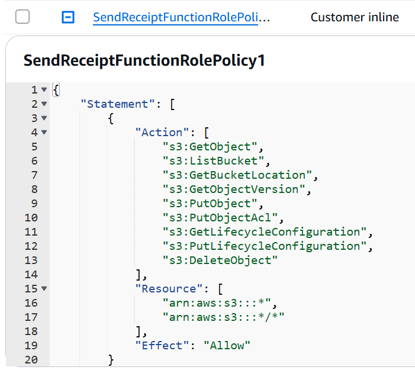

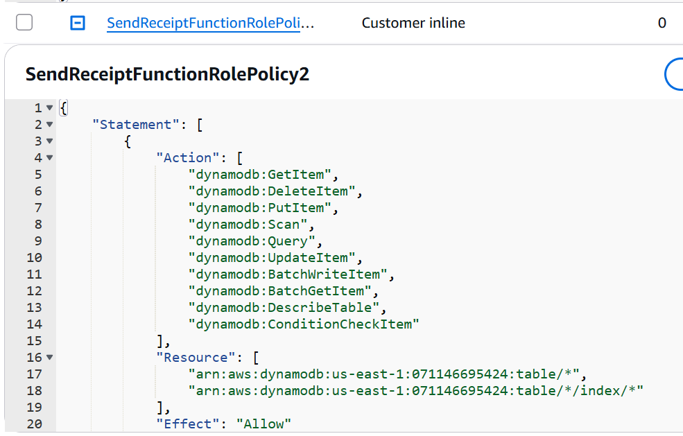

### 2. Confirm impact with the IAM Policy Simulator

IAM → Roles → role → **Simulate** (top-right). Select the role, then run actions like `s3:GetObject`, `s3:PutObject`, and the DynamoDB CRUD set — all are **allowed**:

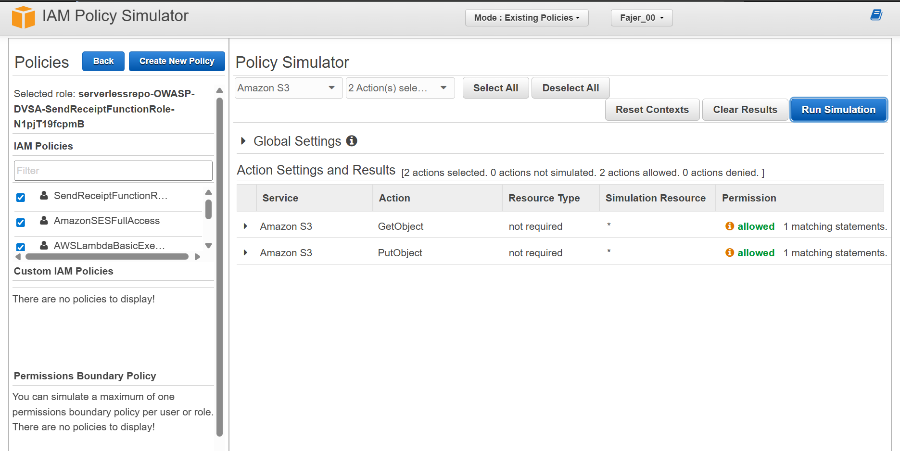

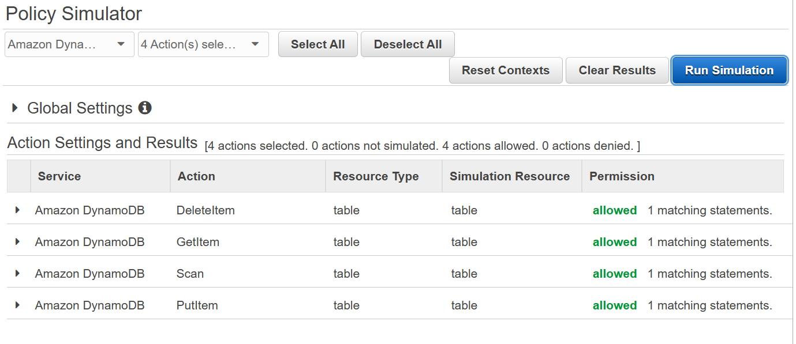

### 3. Find what the function actually uses

IAM → Roles → role → **Last Accessed** (or Access Advisor) shows the services the role has actually called. CloudTrail-based policy generation reveals the real working set:

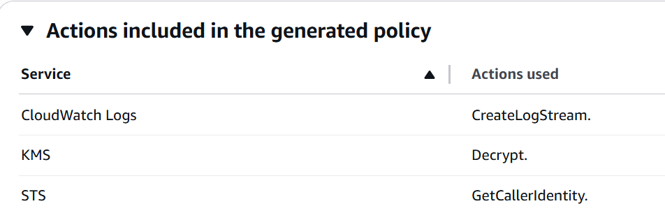

The real working set is logging, KMS decrypt (for env vars), STS, and SES. Everything else is dead weight.

## Fix

The fix is configuration-only — no code changes to the Lambda itself.

### Step A — Remove `AmazonSESFullAccess`

`AmazonSESFullAccess` grants every SES action including identity management, configuration sets, etc. The function only sends email, so we strip this and replace it with a minimal custom policy.

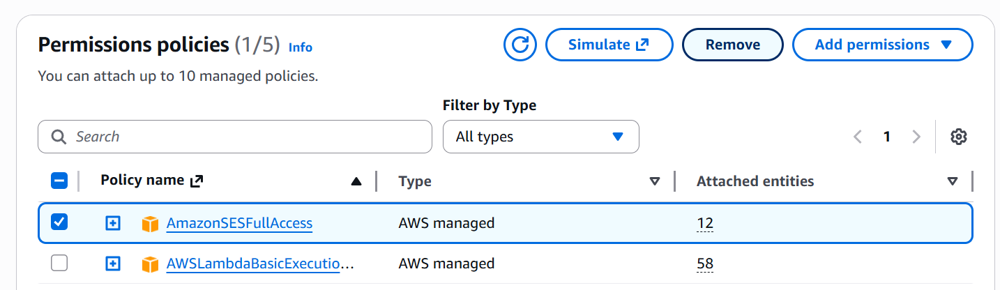

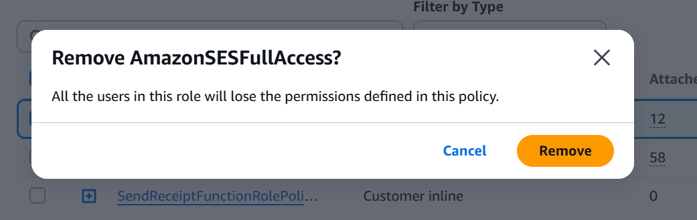

### Step B — Remove the wildcard inline policies

Select both inline policies (S3 wildcard + DynamoDB wildcard) and delete them.

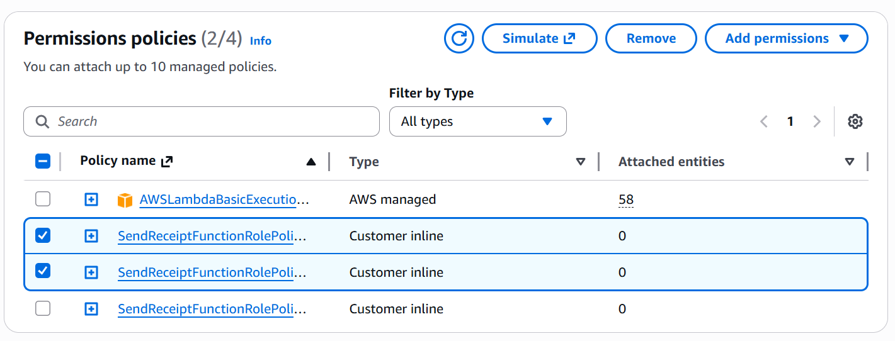

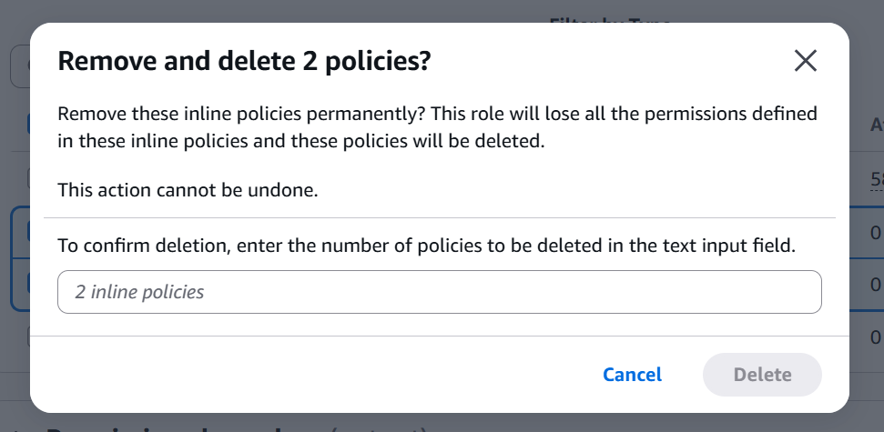

After this step the role only has `AWSLambdaBasicExecutionRole` (managed) and one remaining inline policy:

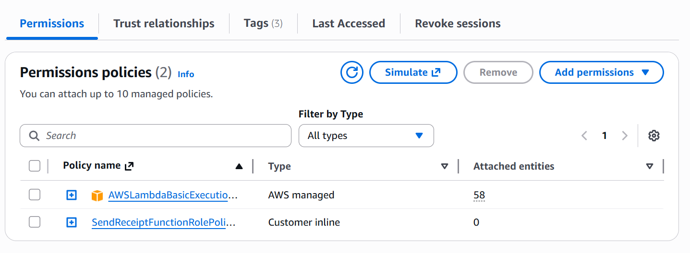

### Step C — Attach a minimal SES policy

Create a new inline (or customer-managed) policy named **`SendReceiptMinimalSES`** containing exactly:

```json
{
  "Version": "2012-10-17",
  "Statement": [
    {
      "Effect": "Allow",
      "Action": [
        "ses:SendEmail",
        "ses:SendRawEmail"
      ],
      "Resource": "*"
    }
  ]
}
```

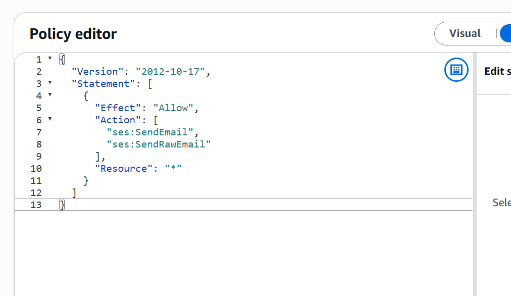

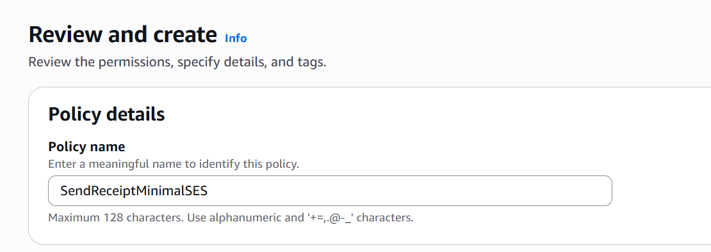

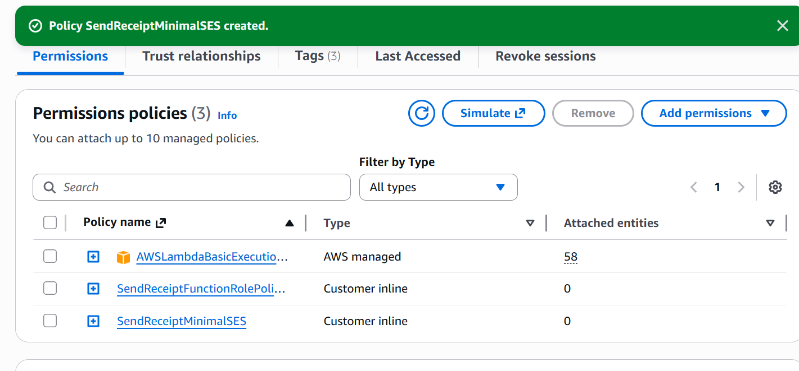

The full JSON is available at [`code/SendReceiptMinimalSES.json`](./code/SendReceiptMinimalSES.json).

> Note: SES `SendEmail` / `SendRawEmail` do not support resource-level constraints in the same way S3 does, which is why `Resource: "*"` is acceptable here. To restrict further, attach an SES-condition (`ses:FromAddress`) or use Identity policies on the verified sender identity.

## Verification

### Policy Simulator after the fix

Run the same eight actions (2 SES + 2 S3 + 4 DynamoDB). Only the two SES actions are allowed; everything else is implicitly denied:

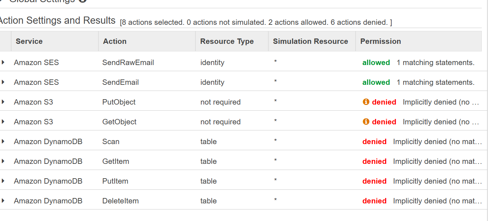

### CloudWatch logs

If anything in the function (or an attacker who managed to inject code) still tries to read DynamoDB, the Lambda runtime now logs an `AccessDeniedException`:

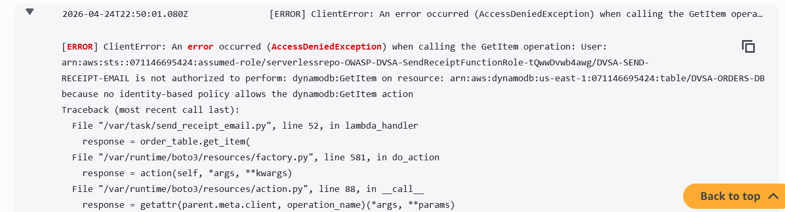

This is the desired outcome — even if the function were compromised, the blast radius is limited to "send some emails," not "read every order record" or "delete every receipt."

## Analysis

### Table A — Behavior

| Vulnerability | Intended Rule | Artifacts | Normal Behavior | Exploit Behavior |
|---|---|---|---|---|
| Over-Privileged IAM Role | Lambda should only access services it needs (SES) | IAM policies, Policy Simulator, CloudTrail/Access Advisor, CloudWatch logs | Function sends receipt emails | Role can read/write any S3 object and any DynamoDB item in the account |

### Table B — Deviation & Remediation

| Vulnerability | Why a Deviation | Class | Fix | Post-Fix |
|---|---|---|---|---|
| Over-Privileged IAM Role | Role grants access far beyond what the function needs | Misconfiguration | Removed `AmazonSESFullAccess` and both wildcard inline policies; attached `SendReceiptMinimalSES` (`ses:SendEmail`, `ses:SendRawEmail` only) | Simulator shows S3/DynamoDB denied; CloudWatch shows `AccessDeniedException` on any unrelated AWS call |

## Takeaway

In a serverless architecture, the Lambda execution role **is** the application's identity. Whatever permissions the role has, the function — and anyone who compromises the function — has too. Wildcards in IAM are not a convenience, they are a blast radius. Use the IAM Policy Simulator and CloudTrail's "actions actually used" report regularly to detect drift and shrink permissions back to what the workload actually needs.
